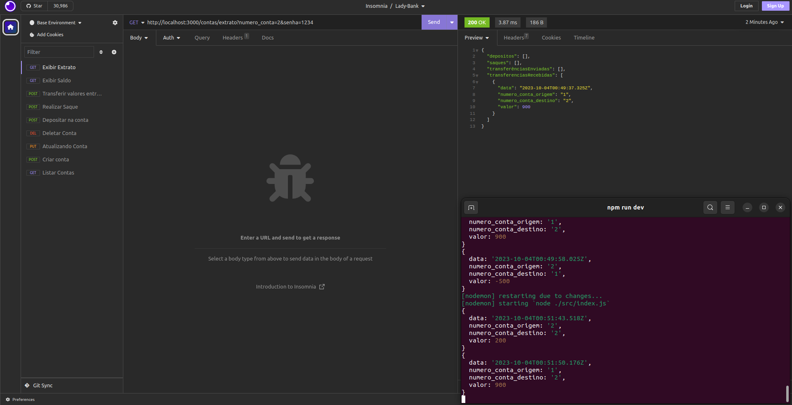

# APIFinanças
API desenvolvida para controle financeiro pessoal. RESTful API que permite:  
Cadastrar Usuário,
Fazer Login,
Detalhar Perfil do Usuário Logado,
Editar Perfil do Usuário Logado,
Listar categorias, 
Listar transações, 
Detalhar transação, 
Cadastrar transação,
Editar transação, 
Remover transação, 
Obter extrato de transações.


<h1 align="center">
  <br>
  
  <br>
  APIFinanças
</h1>

 
<p align="center" >

</p>

## Como Usar

Para clonar e executar esta aplicação, você precisará do Git e do Node.js (que vem com o npm) instalados em seu computador. No seu terminal de comando:

```bash
# Clone o repositorio
$ git clone https://github.com/Joanna-Ribeiro/APIFinancas.git

# Go into the repository
$ cd APIFinancas

# Instale as dependências
$ npm install

# Inicie a aplicação
$ npm run start
```

> **Nota**
>Se você estiver usando o Linux Bash no Windows, [consulte este guia](https://www.howtogeek.com/261575/how-to-run-graphical-linux-desktop-applications-from-windows-10s-bash-shell/) ou utilize o comando `node` a partir do prompt de comando.

## Emailware

APIFinanças é um software de gestão de finanças pessoais . Ou seja, se você gostou de usar este aplicativo ou se ele o ajudou de alguma forma, gostaria que você me enviasse um e-mail para joannac581@gmail.com sobre qualquer coisa que gostaria de dizer sobre este software. Eu realmente aprecio isso!

## Créditos

Este software utiliza os seguintes pacotes de código aberto:

- [Node.js](https://nodejs.org/)
- [Docker](https://www.docker.com/)
- [PostgreSQL](https://www.postgresql.org/)
- [Bcrypt](https://www.npmjs.com/package/bcrypt)
- [Cors](https://www.npmjs.com/package/cors)

---

## Contribuidores ✨

<table>
  <tbody>
    <tr>
      <td align="center" valign="top" width="14.28%"><br /><sub><b>Joanna Ribeiro</b></sub></a><br /><a href="#question-CompuIves" title="Answering Questions">💬</a> <a href="#blog-CompuIves" title="Blogposts">📝</a> <a href="https://github.com/codesandbox/codesandbox-client/issues?q=author%3ACompuIves" title="Bug reports">🐛</a> <a href="https://github.com/codesandbox/codesandbox-client/commits?author=CompuIves" title="Code">💻</a></a> <a href="https://github.com/codesandbox/codesandbox-client/commits?author=CompuIves" title="Documentation">📖</a> <a href="#example-CompuIves" title="Examples">💡</a> <a href="#infra-CompuIves" title="Infrastructure (Hosting, Build-Tools, etc)">🚇</a> <a href="https://github.com/codesandbox/codesandbox-client/pulls?q=is%3Apr+reviewed-by%3ACompuIves" title="Reviewed Pull Requests">👀</a> <a href="https://github.com/codesandbox/codesandbox-client/commits?author=CompuIves" title="Tests">⚠️</a> <a href="#tool-CompuIves" title="Tools">🔧</a></td>
      <td align="center" valign="top" width="14.28%"><br /><sub><b>Jéssica Lira</b></sub></a><br /><a href="https://github.com/codesandbox/codesandbox-client/commits?author=donavon" title="Code">💻</a></td>
    
  </tbody>
</table>

<!-- ALL-CONTRIBUTORS-LIST:END -->


## Obrigada


Agradecemos à Cubos Academy por fornecer uma plataforma educacional de alta qualidade que tem sido fundamental para o desenvolvimento e aprimoramento das habilidades técnicas necessárias para este projeto. 
